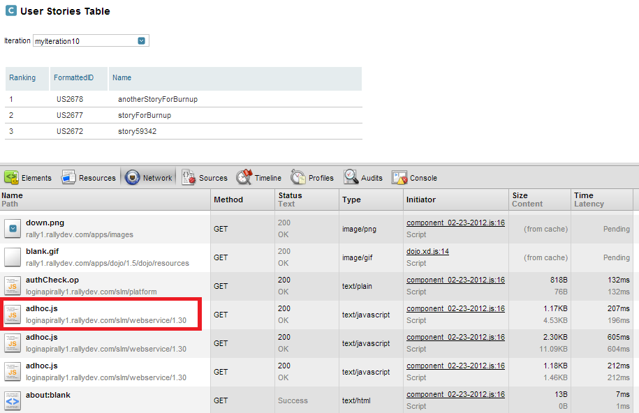

##### LoginKey

###### Overview

The App SDK LoginKey is a feature that allows customers to create an app
that runs external to the Rally product—hosted in an intranet portal such as Confluence
or SharePoint, or on a user's desktop—without being prompted to enter login credentials.
It is especially useful to create dashboards and information radiators for stakeholders
that do not have Rally credentials or experience using the Rally product.

The LoginKey essentially provides a way to embed encoded (not encrypted!) Rally credentials
for a read-only user into the script tag used to reference the App SDK.
Because it is possible for a savvy JavaScript programmer to decrypt the string and
discover the credentials, we require customers wishing to use the LoginKey feature
to read and accept the following disclaimer before using the LoginKey feature.

###### Disclaimer and Limitations

1. The Rally LoginKey feature enables customers to view Rally apps
 and reports without the need to present user credentials (manually).
 Customers can use the LoginKey feature to show Rally content within
 systems like Sharepoint, Confluence, Wiki's, portals, etc.

2. The LoginKey feature accesses Rally via the encoded (not encrypted)
 username and password of a "read-only" Rally user.
 The encoded username and password are stored in a Javascript file that is delivered to the browser.

 This means that a malicious user could determine the read-only username and password
 to your Rally subscription by inspecting the code and thus login to your subscription
 (into the read-only account).

 We strongly recommend only using this feature for displaying information
 on internal systems that already requires authentication.

3. Warnings:
     * For the purpose of the LoginKey user, a Rally workspace administrator account
       which has been demoted to a read-only account will not work as it is still considered
       a NON-read-only account by the LoginKey.
     * The most current version of AppSDK for which the LoginKey feature is version 1.33

4. Tip:
     * AppSDK 1.33 can be utilized concurrently with Rally Webservices API (WSAPI) versions
       up to and including WSAPI 1.43.
     * To utilize a higher version of WSAPI with AppSDK 1.33 one of the following two
       procedures may be followed:
     * Set the API Version in the script include for the sdk.js:
`<script type="text/javascript" src="/apps/1.33/sdk.js?apiVersion=1.43"></script>`
     * Set the API Version on the rallyDataSource object in your Javascript code:

 ````javascript
var rallyDataSource = new rally.sdk.data.RallyDataSource(
                    '__WORKSPACE_OID__',
                    '__PROJECT_OID__',
                    '__PROJECT_SCOPING_UP__',
                    '__PROJECT_SCOPING_DOWN__');
                    rallyDataSource.setApiVersion("1.43");
 ````
     * Caution is recommended when adjusting the WSAPI version for AppSDK Rally Catalog Apps - some Catalog Apps are not compatible with newer versions of WSAPI.

##### Using the App SDK LoginKey Feature

This section describes the steps needed to generate and use an encoded login key with
Rally's [App SDK](https://prod.help.rallydev.com/app-sdk) LoginKey functionality.
This will provide viewer-level functionality for apps into which this code is incorporated.

###### Running an App outside of Rally

This document explains how to create an app that runs outside of Rally (in an Intranet portal,
or on your desktop, for example) without requiring the user to enter Rally credentials.
The credentials are encoded using the
[Encoder Page](https://rally1.rallydev.com/apps/html/EncoderPage.html)
and supplied to the app using the “loginKey=” parameter on the script tag used to include the App SDK.

Since the encoded credentials could be reverse engineered by a savvy JavaScript programmer,
we require the encoded username and password to refer to a read-only Rally user,
i.e. one that only has Viewer permissions for all project to which that user has access.
This restriction to read-only users is enforced by both the
[Encoder Page](https://rally1.rallydev.com/apps/html/EncoderPage.html)
and the App SDK at the time your app is initialized.

To get the example working, follow these steps:

1. Copy and paste the example below into a local HTML file called ExternalAppExample.html:

 ````html
<!DOCTYPE html PUBLIC "-//W3C//DTD XHTML 1.0 Strict//EN" "http://www.w3.org/TR/xhtml1/DTD/xhtml1-strict.dtd">
<html>
<head>
    <title>Login Component Example</title>
    <meta name="Name" content="App Example: LoginKey RallyDataSource" />
    <meta name="Version" content="2011.04" />
    <meta name="Vendor" content="Rally Software" />
    <script type="text/javascript"
            src="https://rally1.rallydev.com/apps/1.25/sdk.js?loginKey=ENCODED STRING GOES HERE">
    </script>
    <script type="text/javascript">
        function onLoad() {
            var rallyDataSource = new rally.sdk.data.RallyDataSource(
                '__WORKSPACE_OID__',
                '__PROJECT_OID__',
                '__PROJECT_SCOPING_UP__',
                '__PROJECT_SCOPING_DOWN__');
            var config = {type: "hierarchicalrequirement", columnKeys:["FormattedID", "Name"]};
            var table = new rally.sdk.ui.Table(config, rallyDataSource);
            table.display("tableDiv");
        }
        rally.addOnLoad(onLoad);
    </script>
</head>
<body>
    <div id="tableDiv" style="float:left;width:400px"></div>
</body>
</html>
````

2. Modify the meta tags to reflect your own name, version, and vendor (your company name) for your example app.

 &lt;meta name="Name" content="App: your app name here">
 &lt;meta name="Version" content="your version here">
 &lt;meta name="Vendor" content="your company name here">

3. If you do not want your app to use the default workspace and project of the "LoginKey user",
 then replace string <b>'__WORKSPACE_OID'</b> and <b>'__PROJECT_OID__'</b>
 with specific workspace and project object IDs (OIDs) if you wish;
 otherwise the default workspace/project for the "LoginKey user" are used.

4. You may also replace <b>'__PROJECT_SCOPING_UP__'</b> and <b>'__PROJECT_SCOPING_DOWN__'</b>
 with 'true' or 'false' to override the defaults (false and true, respectively).

5. To generate the encoded string, point your browser to the
 [Encoder Page](https://rally1.rallydev.com/apps/html/EncoderPage.html).

 A Rally login dialog box will display when you access the
 [Encoder Page](https://rally1.rallydev.com/apps/html/EncoderPage.html).
 Enter the credentials for a "viewer-only" Rally user, one that has only Viewer permissions
 to any projects to which it has access.

 Note: For the purpose of the LoginKey feature,
 a workspace administrator account which has been demoted to a read-only account
 will not work as it is still considered a NON read-only account by the LoginKey.

 Enter the password for this user in the Password text box and
 click the 'Submit' button to generate the encoded key.
 Click the key string to select it, and
 use your browser's copy function (e.g. Control-C) to copy it to the clipboard.

6. Paste the encoded string as the value for the loginKey parameter in the sdk.js
 script tag in the example code below, replacing "ENCODED STRING GOES HERE".
 The resulting script tag will look similar to the following.
 (Note: Line breaks may appear in the following text,
 but should not be added when you paste the string into the script tag).

 ````html
<script type="text/javascript" src="/apps/1.25/sdk.js?debug=true&loginKey=acda07bd5e53c99ae953f5374cf6e9c4cd996a7ad133a5c2c8cc406caf1d9beb|f9f08a4699e83a27ecfbc462c3b51314|e5217f5acc26020b9a45f0009f0b028757b3a2ecfd7a72ed7a6ab5fb2f47df0ab64024ef268bd302a4117e0f93ed9bfb|71,50,65,97,121,3,17,51,117,7,150,38,80,97,148,71"></script>
````

7. NOTE: The encoder page requires a "viewer-only" user to generate the encoded key string.
 The key is visible to anyone using the browser in which the external app is displayed
 using the brower’s View Page Source feature. This means that a malicious user could
 determine the readonly user and password to your Rally subscription by inspecting the code.
 <b>Treat the login key just as you would a password! Don’t share your code
 (which contains the key) with anyone you don’t trust.</b>


###### Running a Shared App outside of Rally

Similar to the steps above, you can also display shared Rally apps.
This means the App must be "shared" to run outside of Rally.
An unshared app will result in a 404 Page Not Found error.

###### Confluence access to Standard Reports

This example shows how to display Rally
[Standard Reports](http://prod.help.rallydev.com/help/standard-reports)
in a Confluence page without requiring Confluence users to enter Rally credentials.

1.  Create a Confluence page and open it for editing.
 Make sure you select the "Wiki Markup" tab in the Confluence editor.
 Note: Do not reselect the 'Rich Text' editor tab once your code has been copied into the editor.
 Doing so will escape some of the content and your page will not work.

2.  Copy and paste the following example code (app) into the file:

 ````html
    <title>Login Component Example</title>
    <meta name="Name" content="App Example: Confluence Standard Report" />
    <meta name="Version" content="2011.04" />
    <meta name="Vendor" content="Rally Software" />
    <script type="text/javascript"
            src="https://rally1.rallydev.com/apps/1.25/sdk.js?loginKey=ENCODED STRING GOES HERE">
    </script>
    <script type="text/javascript">
        function onLoad() {
            rally.sdk.ui.AppHeader.destroy();
            var reportConfig = {report: rally.sdk.ui.StandardReport.IterationBurndown, width : 400, height: 300};
            var report = new rally.sdk.ui.StandardReport(reportConfig);
            report.display("reportDiv");
        }
        rally.addOnLoad(onLoad);
    </script>
    <div id="reportDiv" style="float:left; width: 400px; margin-left:20px"></div>
````

3. Replace "ENCODED STRING GOES HERE" text with the encrypted login key produced by the
 [Encoder Page](https://rally1.rallydev.com/apps/html/EncoderPage.html)
 Page as described above in Running an App outside of Rally.
 You must log in to the Encoder Page as a Rally viewer-only user.

4.  Enter a title for the page and click the 'Save' button.

5.  The Rally
 [Standards Report](http://developer.rallydev.com/help/standard-reports)
 should be displayed on the Confluence page.

6.  Read the
 [Standards Report](http://developer.rallydev.com/help/standard-reports)
 page in the Rally help wiki to learn more about the different kinds of Standard Reports and additional parameters you can modify.

Notes:
 * Your installation of Confluence must be set up to support the {html} tag.
 More information about how to get this for your Confluence installation can be found here and here.
 * In general, you should be able to convert any app to run in Confluence by removing
 &lt;html>, &lt;head>, and &lt;body> tags (and the corresponding closing tags),
 and adding the {html} macro as the first and last lines.


###### SharePoint access to Standard Reports

This example shows how to display a Rally Standard Report in a SharePoint form
Web Part without requiring SharePoint users to enter Rally credentials.

1.  Copy and paste the example code below into a text editor to begin creating your own page:

 ````html
<!DOCTYPE html PUBLIC "-//W3C//DTD XHTML 1.0 Strict//EN" "http://www.w3.org/TR/xhtml1/DTD/xhtml1-strict.dtd">
<html>
<head>
    <title>Login Component Example</title>
    <meta name="Name" content="App Example: SharePoint Standard Report" />
    <meta name="Version" content="2011.04" />
    <meta name="Vendor" content="Rally Software" />
    <script type="text/javascript"
            src="https://rally1.rallydev.com/apps/1.25/sdk.js?loginKey=ENCODED STRING GOES HERE">
    </script>
    <script type="text/javascript">
        function onLoad() {
            rally.sdk.ui.AppHeader.destroy();
            var reportConfig = {report: rally.sdk.ui.StandardReport.IterationBurndown, width : 400, height: 300};
            var report = new rally.sdk.ui.StandardReport(reportConfig);
            report.display("reportDiv");
        }
        rally.addOnLoad(onLoad);
    </script>
</head>
<body>
    <div id="reportDiv" style="float:left; width: 400px; margin-left:20px"></div>
</body>
</html>
````

2.  Replace "ENCODED STRING GOES HERE" text with the encrypted login key produced by the
 [Encoder Page](https://rally1.rallydev.com/apps/html/EncoderPage.html).
 You must log in to the Encoder Page as a Rally read-only user.

3.  Add a new Web Part Page in SharePoint and open that page.

4.  Select "Edit Page" from the Site Actions Menu.

5.  Select "Add a Web Part" on the area of the page you want to add the report.

6.  In the "Add a Web Part" menu select Form Web Part.

7.  Click the Source Editor... button to edit the code for the web part, and paste in your example code.

8.  Click the Save button in the Source Editor. Your report should display in the Web Part.


###### Multiple Rally Standard Reports in one SharePoint WebPart

Adding a second WebPart to a SharePoint page will cause the first WebPart to stop displaying its Rally content.
Instead, use only one WebPart, but modify your HTML code to put each chart in its own div.
You will need to use a separate config object for each
[Standard Report](http://prod.help.rallydev.com/help/standard-reports).

Example Code:

````html
<!DOCTYPE html PUBLIC "-//W3C//DTD XHTML 1.0 Strict//EN" "http://www.w3.org/TR/xhtml1/DTD/xhtml1-strict.dtd">
<html>
<head>
<title>Login Component Example</title>
<meta name="Name" content="App Example: SharePoint Standard Reports" />
<meta name="Version" content="2011.04" />
<meta name="Vendor" content="Rally Software" />
<script type="text/javascript"
        src="https://rally1.rallydev.com/apps/1.25/sdk.js?loginKey=ENCODED STRING GOES HERE">
</script>
<script type="text/javascript">
    function onLoad() {
        rally.sdk.ui.AppHeader.destroy();
        var reportConfig1 = {report: rally.sdk.ui.StandardReport.IterationDefectsbyState,  width : 400, height: 300};
        var report1 = new rally.sdk.ui.StandardReport(reportConfig1);
        report1.display("reportDiv1");
        var reportConfig2 = {report: rally.sdk.ui.StandardReport.IterationDefectsbyPriority, width : 400,  height: 300};
        var report2 = new rally.sdk.ui.StandardReport(reportConfig2);
        report2.display("reportDiv2");
    }
    rally.addOnLoad(onLoad);
</script>
</head>
<body>
    <div id="reportDiv1" style="float:left;width:400px"></div>
    <div id="reportDiv2" style="float:left; width: 400px; margin-left:20px"></div>
</body>
</html>
````

##### On-Premises Caveats

LoginKey functionality works out of box for Rally's on-demand (SAAS) editions.
LoginKey was designed with on-demand Rally in mind, and its functionality with on-premise Rally is limited. 

LoginKey with on-demand Rally has a capability to trick the browser
to create a separate session cookie to work in a scenario when
a user loads a Rally app or a report externally in a browser
(using encoded read-only credentials) alongside with another tab
in the same browser where an editor user is already logged in to Rally tool.
This use case should be avoided and is not supported with On-Premises.

This limitation has important implications. Two secreenshots below (from Firebug and Chrome's Dev Tools)
show where the request comes from in SAAS environment when LoginKey is configured and working correctly.

from Chrome's Dev Tools



from Firefox Firebug:


The URL is loginapirally1.rallydev.com. There is no equivalent of that in On-Premises environment.
Theoretically, having a secondary DNS and a wild card SSL certificate would make the scenario work in On-Premise environment.
However after extensive troubleshooting we came to the conclusion that secondary DNS is not an answer, and expecting the customers

(1) to setup a secondary DNS,
(2) to purchase a wild card SSL certificate from a certificate authority, and
(3) edit EncoderPage.html to replace SAAS-specific code to a code specific to their environment

if (server[0] === 'rally1') {
          server[0] = 'loginapirally1'
          
is unreasonable and impractical.

These three steps are mentioned above only to provide details on the complications that arise in the scenario
when LoginKey is used On-Premises.

Those steps are not recommended, and not supported. An attempt to fake a secondary DNS similar to the way it is done
in SAAS, but without the benefit of the wild card SSL certificat will result in certificate errors.

Also note that since there is no separate cookie for LoginKey in On-Premises user's browser, it may require clearing the cache in order to make
sure that the read-only user's credentials are being used when Rally custom app or a standard report is loaded outside of Rally.

Another implication is as follows:

Some users found convenient to use LoginKey in custom apps that access their dashboards and reports via iframe's src property.
We do not encourage this usage scenario because of a potential security risk.
The example below is shown only for the purpse of illustrating why it works in SAAS environment but not in On-Premises:

Let's say you are using a LoginKey encoded string in the javascript include as expected:
<script type="text/javascript" src="https://rally1.rallydev.com/apps/1.24/sdk.js?loginKey=YOUR ENCODING STRING GOES HERE"></script>

and yet the iframe src property is pointing to rally1.rallydev.com:
 rally.addOnLoad(function() {

                var iframe = document.createElement("iframe");

                iframe.src = "https://rally1.rallydev.com/#/9987108532d/custom/10238666389"; //USE YOUR OWN URL

                iframe.width = 1400;

                iframe.height = 800;

                document.getElementById("ext-gen104").appendChild(iframe);

});

In  this case you will get prompted to login because the encoded credentials in the javascript include will have no effect.
Since LoginKey works by tricking the browser to create a separate cookie for loginapirally1.rallydev.com
to make this work the iframe src property should reference loginapi "server":

  iframe.src = "https://loginapirally1.rallydev.com/#/9987108532d/custom/1023866638";
  
There is no equivalent to loginapirally1 in On-Premises scenario, and this method of accessing your Rally data externally, regardless of its merits and potential security risk, will not work in On-Premise from the outset.

##### Troubleshooting

LoginKey is not specific to Sharepiont, or Confluence or any other 3rd party system. Rally support may not be able to troubleshoot factors specific to deployment of apps in those systems.
Regardless of the deployment target there are troubleshooting steps that will allow to narrow down the problem.

(I) Make sure that you have created a new read-only user.

1. A read-only user that you create must have no editor rights to any project within the Rally workspace where you want to use the LoginKey functionality. If you have a deeply nested project structure please make sure there are no projects where this user has editor rights.

2. A user that was once a workspace administrator and later demoted to a read-only user will not work with LoginKey: due to an idiosyncrasy in our permissions model, a user like that would not be recognized by LoginKey as a read-only user.

3. Prior to accessing the encoded page to generate the encoded string for a read-only user please log out of Rally if you are currently logged in to Rally in another tab of the same browser with an editor or administrator credentials. There is certainly a redundancy here: you will need to login to Rally with those read-only credentials, and then access the encoder page and will be asked for the same credentials again.

(II) Test your app outside of Rally, directly in the browser, without LoginKey:
Rally apps can be displayed outside of Rally in a browser  without the LoginKey.
You will be prompted to login.

Enable the debugging in a browser, e.g. Firebug plugin in Firefox, or Dev Tools in Chrome. Are there errors in the Console?

(III) Test your app outside of Rally, directly in the browser, with LoginKey:
Assuming the step above was successful it is time to test LoginKey when running a custom app outside of Rally, in a browser. If you ran into problems at this stage enable DevTools in IE and Chrome browsers and check javascript console for errors.
To further troubleshoot a problem, check if adhoc.js request comes from loginapirally1.rallydev.com, and not rally1.rallydev.com as shown in the screenshots above.

(IV) Test your app in the portal of your choice:
If the app runs successfully in the browser with LoginKey, test it in SharePoint, Confluence, etc.
